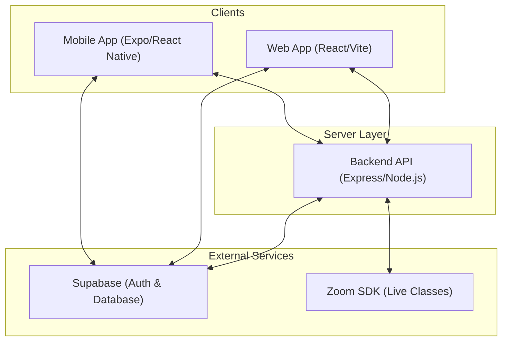

# CohortPlus - Unified Learning Platform

CohortPlus is a comprehensive SaaS cohort-based learning platform designed to provide a premium experience for both tutors and students. The ecosystem consists of a modern web application, a robust backend API, and a cross-platform mobile application.

---

## 🏗️ System Architecture

The following diagram illustrates how the various components of CohortPlus interact:



---

## 📂 Project Structure

The repository is organized into three main components:

| Directory | Component | Description |
|-----------|-----------|-------------|
| [`app/`](./app) | **Web Frontend** | Modern React dashboard for students and tutors. |
| [`backendV1/`](./backendV1) | **Backend API** | Node.js/Express server handling logic and integrations. |
| [`CohortPlus_mobile/`](./CohortPlus_mobile) | **Mobile App** | Cross-platform Expo app for on-the-go learning. |

---

## 🚀 Tech Stacks

### 🌐 Web Frontend (`app/`)
- **Framework**: React 18 + Vite
- **Styling**: Tailwind CSS + shadcn/ui
- **Auth**: Supabase Auth
- **Communication**: Axios with JWT Interceptors

### ⚙️ Backend API (`backendV1/`)
- **Runtime**: Node.js (ES Modules)
- **Framework**: Express.js
- **Services**: Supabase SDK, Zoom Web SDK Integration
- **Middleware**: CORS, Dotenv, Multer (File Uploads)

### 📱 Mobile App (`CohortPlus_mobile/`)
- **Framework**: Expo + React Native
- **Styling**: NativeWind (Tailwind for React Native)
- **Navigation**: Expo Router (File-based)
- **Theming**: Dark/Blue Premium Theme

---

## ✨ Key Features

- **🔐 Unified Authentication**: Secure login/registration via Supabase with role-based access (Student/Tutor).
- **🎓 Course Management**: Tutors can create courses, manage batches, and schedule live sessions.
- **📚 Enrollment System**: Students can browse courses, enroll in batches, and track their progress.
- **📹 Live Classes**: Integration with Zoom SDK for real-time interactive learning sessions.
- **💬 Batch Chat**: Real-time communication within cohorts (planned/in-progress).
- **📱 Mobile Sync**: Seamless experience across web and mobile devices.

---

## 🛠️ Getting Started

### Prerequisites
- **Node.js**: v18 or higher
- **npm**: v9 or higher
- **Expo GO**: (Mobile development)

### Quick Setup

1. **Clone the repository**:
   ```bash
   git clone <repository-url>
   cd cohortplus
   ```

2. **Backend Setup**:
   ```bash
   cd backendV1
   npm install
   # Configure .env (see .env.example)
   npm start
   ```

3. **Web Setup**:
   ```bash
   cd ../app
   npm install
   # Configure .env (see .env.example)
   npm run dev
   ```

4. **Mobile Setup**:
   ```bash
   cd ../CohortPlus_mobile
   npm install
   npx expo start
   ```

---

## 🔑 Environment Configuration

You will need to set up `.env` files in each project directory. Key variables include:

- `SUPABASE_URL`: Your Supabase project URL.
- `SUPABASE_ANON_KEY`: Your Supabase anonymous key.
- `ZOOM_SDK_KEY` / `ZOOM_SDK_SECRET`: For live session integration.
- `API_BASE_URL`: Pointer to the backend server (e.g., `http://localhost:5000/api`).

---

## 📄 Documentation

- [Project Implementation Summary](./PROJECT_SUMMARY.md)
- [Web Frontend README](./app/README.md)
- [Mobile App README](./CohortPlus_mobile/README.md)

---

## ⚖️ License
MIT License - Developed for educational and production-ready environments.
